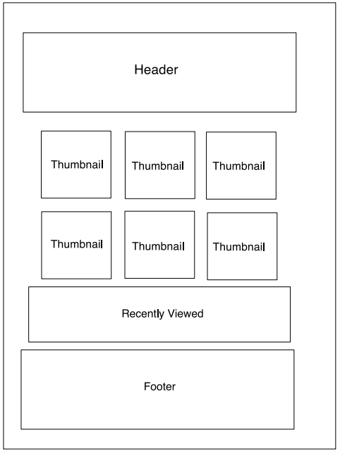
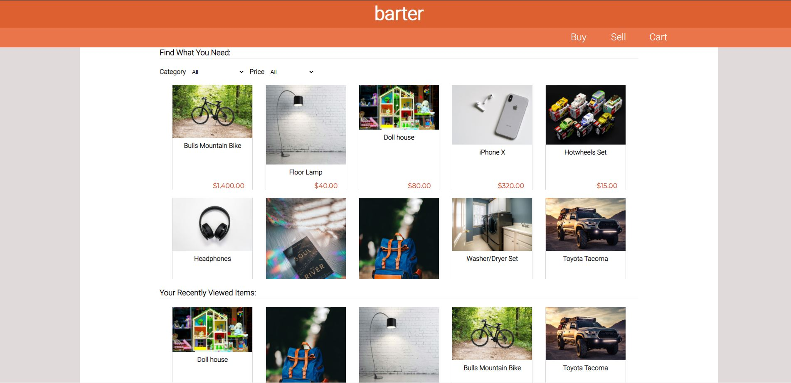

# barter

## Date: 3/5/21

### By: Luke Arenas

#### [Website](https://lukearenas.github.io/Personal-Website/) | [GitHub](https://github.com/LukeArenas) | [LinkedIn](https://www.linkedin.com/in/lukearenas/)

---

### ***Description***

Barter is a community-focused ecommerce app. It allows users to both list items they no longer need and buy items from their neighbors, all through a convenient medium. Customers are able to view the item's photo, price, description, condition, and the seller's customer rating before deciding to purchase or not. In addition, all shoppers will be able to see their recently viewed items.

### **Check out my deployed project** [HERE](https://murmuring-beyond-05467.herokuapp.com/ )

***

### ***Project Planning***

 #### [Workflow](https://trello.com/b/3sCCi1g8/barter) | [Dataflow](https://lucid.app/lucidchart/5d649ab4-9a4d-464f-a853-ad56af8501d7/edit?beaconFlowId=24E8AFF870EC9DEF&page=0_0#) | [Entity-Relationship Diagram](https://app.diagrams.net/#G1XTHZyrNTRPlAOTUXTbyjESE6pbxWWU9L)

***

### ***Technologies***

* MongoDB
* Express.js
* React.js
* Node.js

***

### ***Back-end Decisions***

For the scope of this project, I decided it would be best to design a MongoDB database with two schemas/documents - one for the sellers and one for the listings. These two documents would have a one to many relationship with each seller being able to list multiple items. Given this, each listing would be assigned a seller_id upon creation. I also for simplicity sake decided to keep the controllers and routes for each model separate. Each controller contains a get, post, and delete function. In practice, the delete function for the seller is never called by the end user but I added it in so I could go in the back end and delete test cases. There are also additional get functions that allow the front-end to receive information depending on which parameter is passed in (e.g. getting all listings using seller_id). Lastly, the routes were defined in a separate file from the server so that just two lines of code in the server could reference all of the routes for the sellers and listings.

### ***Front-end Decisions***

In the planning stages of this project, I concluded that five main webpages would suffice for what I wanted this website to do. Those pages were Welcome, Buy, Sell, Cart, and Item Details. Some of these pages would also have components that could be reused on the same or different pages. For example, the thumbnail component is used twice on the Buy page and once on the Sell page. The sell page would allow a user to upload their own listing(s), as well as view the listings they've created in the past. The buy page would display not only the user's listings, but all listings created in the database. I also knew to simulate an ecommerce site, I wanted to include a recently viewed component on the Buy page. This would allow users to quickly return to an item they found interesting.

### ***Buy Page WireFrame***

### ***Buy Page Implementation***

***

### ***Future Updates***

- [ ] Functioning checkout button
- [ ] Confirm alert when delete button clicked
- [ ] Integrate inventory values
- [ ] User authentication

***

### ***Credits***

* [Bits and Pieces](https://blog.bitsrc.io/must-know-concepts-of-react-router-fb9c8cc3c12)
* [npm](https://www.npmjs.com/package/react-currency-input-field)
* [Pexels](https://www.pexels.com/)
* [CSS-Tricks](https://css-tricks.com/)
* [Undraw](https://undraw.co/)
* [Github:s-yadav](https://github.com/s-yadav/react-number-format)
* [ObjectRocket](https://kb.objectrocket.com/mongo-db/how-to-use-the-mongoose-update-query-in-nodejs-1303)
* [W3schools](https://www.w3schools.com/)
* [StackOverflow](https://stackoverflow.com/)
