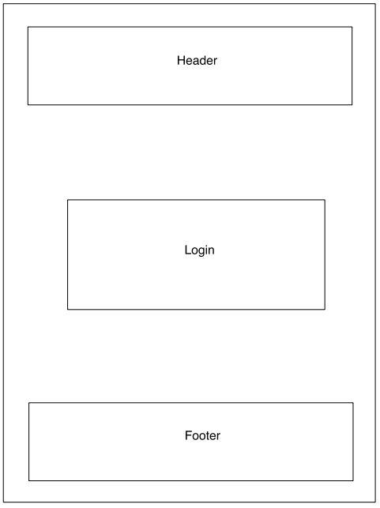
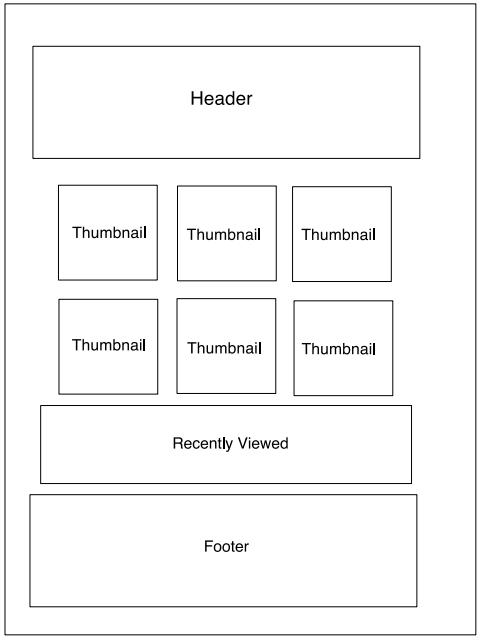
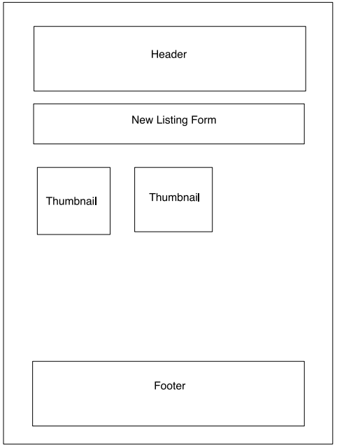
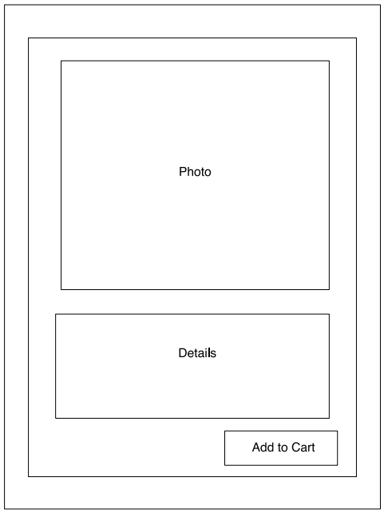
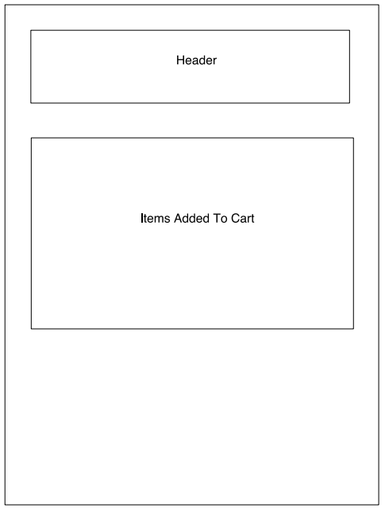

# Barter

## Date: 3/5/21

### By: Luke Arenas

#### [Website](https://lukearenas.github.io/Personal-Website/) | [GitHub](https://github.com/LukeArenas) | [LinkedIn](https://www.linkedin.com/in/lukearenas/)

---

### ***Description***

Barter is a community-focused ecommerce app. It allows users to both list items they no longer need and buy items from their neighbors, all through a convenient medium. Customers are able to view the item's photo, price, description, condition, and the seller's customer rating before deciding to purchase or not. In addition, all shoppers will be able to see their recently viewed items.

***

### ***Project Planning***

 #### [Workflow](https://trello.com/b/3sCCi1g8/freetrade-working-title) | [Dataflow](https://lucid.app/lucidchart/5d649ab4-9a4d-464f-a853-ad56af8501d7/edit?beaconFlowId=24E8AFF870EC9DEF&page=0_0#) | [Entity-Relationship Diagram](https://app.diagrams.net/#G1XTHZyrNTRPlAOTUXTbyjESE6pbxWWU9L)

 ### ***Website Wireframes***

#### Welcome Page
 

#### Buy Page

#### Sell Page

#### Item Details Page

#### Cart Page

### ***Technologies***

* MongoDB
* Express.js
* React.js
* Node.js

***

### ***MongoDB Decisions***

### ***Express Decisions***

### ***React Decisions***

### ***Node Decisions***

### ***User Stories***

### ***Screenshots***

***

### ***Future Updates***

- [ ] 
- [ ] 

***

### ***Credits***

* [Bits and Pieces](https://blog.bitsrc.io/must-know-concepts-of-react-router-fb9c8cc3c12)
